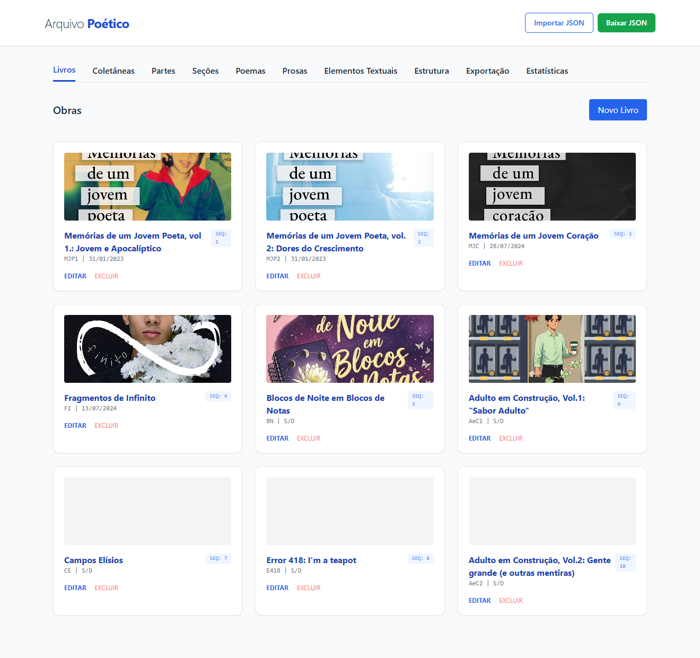
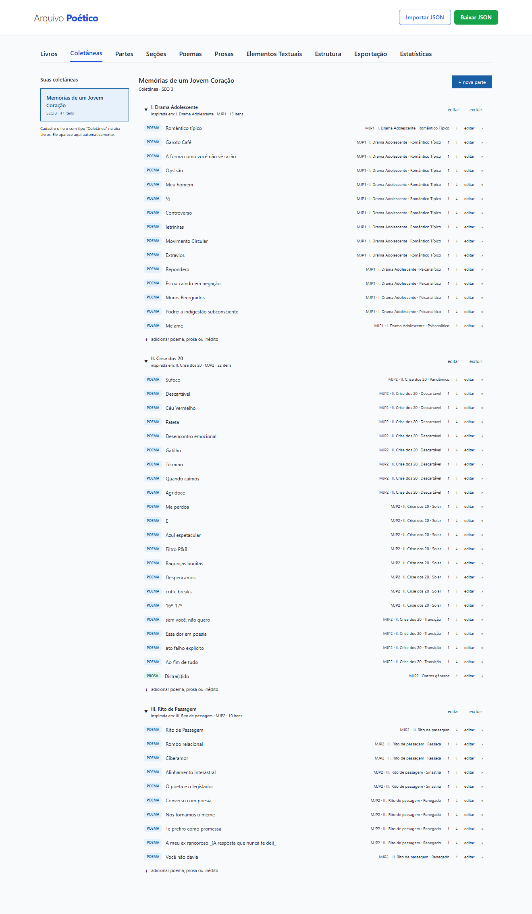
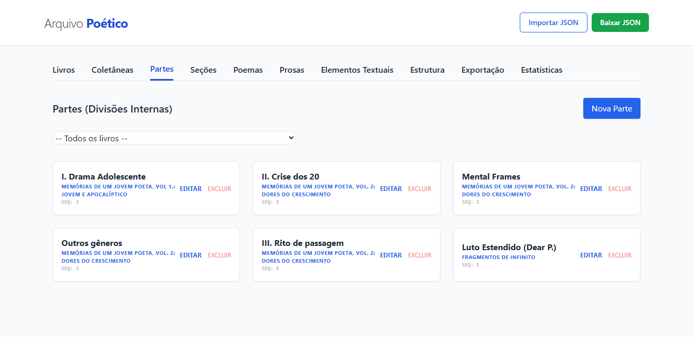
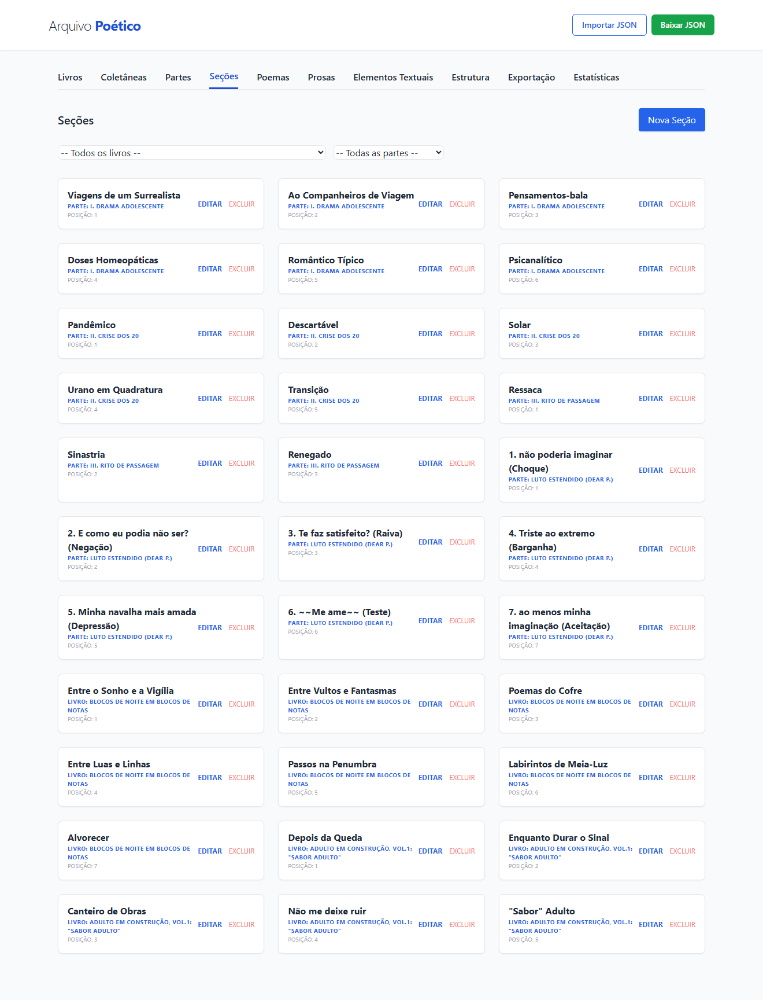
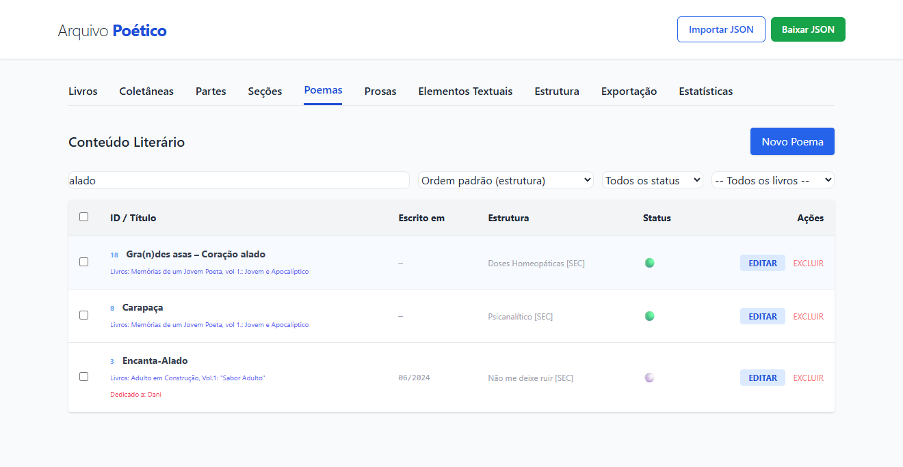
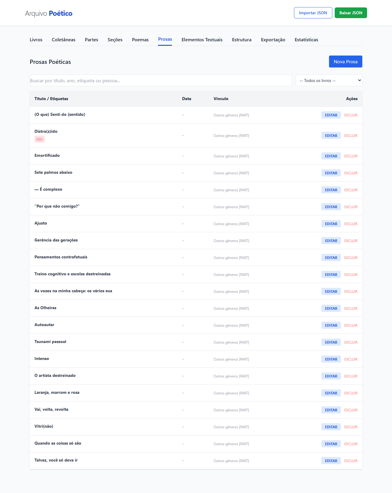
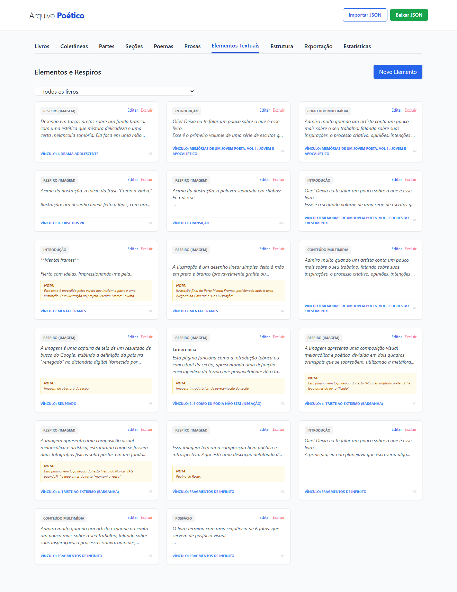
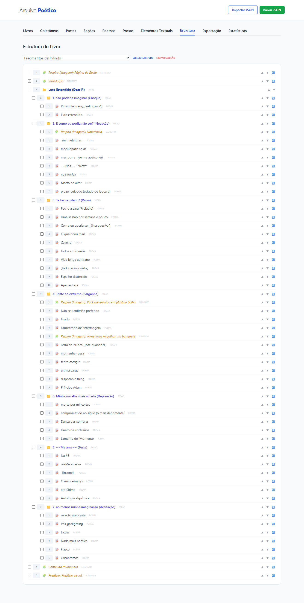
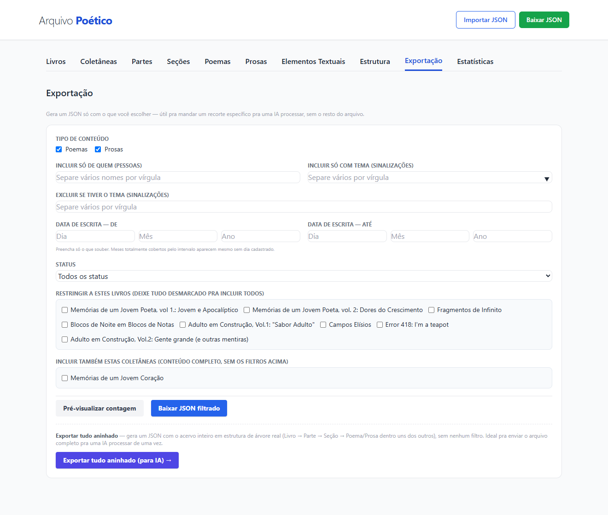
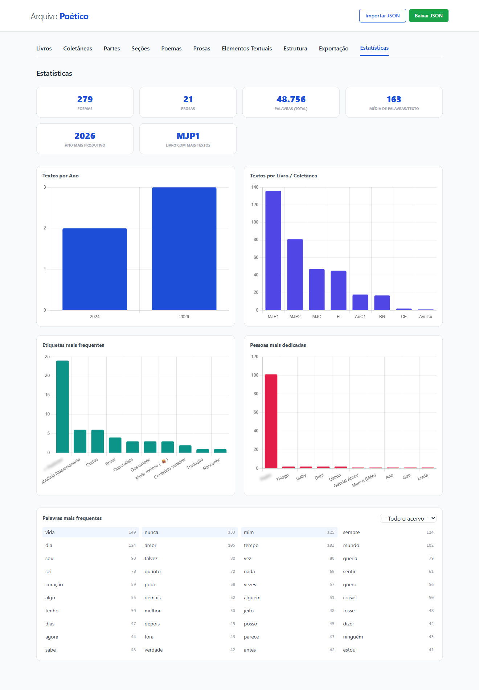

# Arquivo Poético

🌐 **Language:** **English** (you are here) | [Português](README.pt-br.md)

Local, backend-free app for organizing, editing, and exporting a collection of
poems, prose pieces, books, and anthologies. Everything runs in the browser;
text data is saved to `localStorage` and cover images to `IndexedDB`. The
`.json` files are used for backup and data exchange — the full backup can
embed covers as base64 (the "capas" checkbox next to "Download JSON"), but
selective exports never include images.


---

## Getting started

The app uses ES Modules, so **it won't work by opening `index.html` directly**
from the file system (browser CORS restriction). You need a static local
server:

- **VS Code:** install the [Five Server](https://marketplace.visualstudio.com/items?itemName=yandeu.five-server) or Live Server extension and click "Go Live"
- **Python:** `python -m http.server` in the project folder, then visit `http://localhost:8000`
- **Node:** `npx serve .` in the project folder

No dependencies need to be installed. Tailwind CSS is loaded via CDN; Chart.js and DOMPurify are vendored locally in `assets/js/`.

---

## Screenshots

### Books



### Anthologies



### Parts



### Sections



### Poems



### Prose



### Elements



### Structure



### Export



### Statistics



---

## Folder structure

```
/
├── index.html               → App skeleton: header, nav, tabs and #modais-container
├── filtrar.html              → Separate tool for registering alternative versions
│                                of sensitive texts before exporting to an AI
│                                (see "Alternative Versions" section below)
├── README.md
│
├── assets/
│   ├── css/
│   │   └── style.css        → Styles complementing Tailwind (CDN)
│   ├── icons/
│   │   └── favicon.svg, favicon-32.png, favicon-180.png
│   ├── logo/
│   │   └── Logo.png, Logo.ai, Logo (variacoes).png, Logo (com margem).png
│   └── screenshots/         → Screenshots used in the README
│
├── js/                       → All app logic (ES Modules)
│   ├── main.js               → Entry point; wires the HTML onclick="" handlers to
│   │                           functions and registers each modal (id, file, init)
│   ├── db.js                 → Central state + persistence (localStorage)
│   ├── capas.js              → Cover image storage via IndexedDB;
│   │                           auto-resizes and compresses on upload
│   ├── modais.js             → Lazy loading of modals via fetch, with caching
│   ├── ui.js                 → Tabs, dropdowns, auto-fill (re-exports
│   │                           toggleModal/garantirModal from modais.js)
│   ├── render.js             → Orchestrator: calls, in order, each tab's
│   │                           renderers on every 'db:saved' event (see the 3
│   │                           modules below for each one's logic)
│   ├── render-listas.js      → Rendering of Books/Parts/Sections/
│   │                           Poems (+ multi-select)/Prose/Elements
│   ├── render-estrutura.js   → "Structure" tab tree: cascading selection,
│   │                           move ▲▼, move between levels
│   ├── render-lightbox.js    → Loads covers from IndexedDB asynchronously
│   │                           and shows a navigable lightbox
│   ├── autobackup.js         → Automatic snapshots of the collection in
│   │                           IndexedDB (safety net alongside the manual
│   │                           "Download JSON" — doesn't replace it)
│   ├── forms.js              → Submit/edit Book, Part, Section, Poem,
│   │                           Prose, Element
│   ├── editor.js             → Text formatting toolbar + tags/people
│   ├── coletaneas.js         → Anthologies tab logic
│   ├── estatisticas.js       → Statistics panel (Chart.js)
│   ├── exportar.js           → Selective export (by attributes) + export
│   │                           of the Poems/Prose listing selection +
│   │                           full nested exports
│   ├── nesting.js            → Hierarchical nesting logic (used by
│   │                           exportar.js)
│   └── utils.js              → Pure functions with no internal dependencies;
│                               includes the delete-confirmation modal,
│                               ID generation (gerarId), and HTML escaping
│                               (escapeHtml)
│
├── modais/                    → HTML for each modal, loaded on demand
│   ├── modal-livro.html
│   ├── modal-parte.html
│   ├── modal-secao.html
│   ├── modal-poema.html
│   ├── modal-prosa.html
│   ├── modal-elemento.html
│   ├── modal-col-parte.html
│   └── modal-col-item.html
│
└── data/
    └── arquivo_poetico_backup.json   → Sample/backup data (not read automatically)
```

---

## Main features

- **Hierarchical registration**: Books → Parts → Sections, with Poems, Prose,
  and Text Elements (introduction, multimedia, commentary, interlude,
  afterword) able to link to any of these three levels.
- **Anthologies**: a separate tab for curating collections. An Anthology is a
  record in `db.livros` with `tipo: "Coletânea"`; it has Parts (the same
  `db.partes` collection as regular Parts, distinguished by `livroId`) and
  each Part has Items in `db.itensColetanea` (linked via `parteId`), which
  reference existing poems/prose (`refId`/`refTipo`) or hold anthology-only
  text (`textoOverride`). Deleting an anthology cascades to its parts and
  items, without affecting the original texts.
- **Covers**: Books, Parts, and Sections accept a cover image. Images are
  stored in `IndexedDB` and never end up in the backup JSON. The viewing
  lightbox supports navigation between covers with ◀ ▶ and the ← → keys.
- **Partial dates**: "Date Written" and "First Publication Date" accept
  partial day/month/year/hour/minute — fill in only what you know.
- **Rich text editor**: bold, italic, underline, alignment, color, font,
  and size applied inline to the poem text.
- **Tags and people**: theme tags and "dedicated to / about whom" as
  reusable labels, with `<datalist>` suggestions.
- **Poem status**: 🟡 Incomplete, ⚪ Complete, 🟢 Published, 🔵 Migrated
  (text moved from one book/section to another), and 🔴 Discarded.
- **Migration between books** (Poem): "Cut from" and "Released in" fields
  (Book + Part/Section), free text with `<datalist>` suggestions drawn from
  already-registered books/parts/sections — meant for poems with Migrated
  status, but fillable at any time (the source book may no longer exist as
  a record in the archive). Choosing an already-registered Section
  auto-fills the corresponding Book; typing/choosing the Book filters
  Section suggestions to that book only.
- **Intertextuality** (Poem): a list of external references (song, book,
  film/series, video, quote...), each with a type + text — a poem can
  reference several different reference types at once. Each item can be
  edited in-place (click ✎ to reopen a saved item before deleting it).
- **Attachments** (Poem): a list of items accompanying the text —
  Illustration, Photo, Lettering, Recited video, Video comments, or Other —
  each with a type + description, and a link (required for video types,
  optional for the rest). A poem can have one or several attachments of
  different types at once, each editable in-place like Intertextuality. A
  free-text field — **Attachment Note** — covers observations about the set
  as a whole (when the attachments relate to each other — theme, style,
  unity — rather than each one individually).
- **Marginal Annotations** (Poem): a list of comments from another "voice"
  written over the text — usually in a cursive font different from the
  poem's — tied to a specific verse or passage. Each item has a reference
  passage + position + font + text; position and font are free text with
  `<datalist>` suggestions (not a closed select), since position can be
  compound (e.g. "below and to the left") and the font, while it tends to
  repeat, can vary. Different from Intertextuality (a dialogue with
  something outside the archive) and from Visual Description (the poem
  itself laid out unusually in space, in the same font as the text).
- **Redaction**: free-text notes field about data redaction.
- **Sensitive Content and Triggering Vocabulary** (Poem): two dedicated
  fields for notes about the text itself. Filling in either one
  automatically flags the poem for review in Alternative Versions
  (`filtrar.html`) — see the dedicated section below.
- **Structure**: navigable tree of an entire book, with multi-select for
  partial export and ▲▼ buttons for inline reordering.
- **Statistics**: overall summary, distribution by year/book/theme/person
  (Chart.js), and most frequent words (with Portuguese stopwords).
- **Selective export**: by type, person, theme, date range, status, and
  specific books/anthologies — plus the option to export everything nested
  (Book → Part → Section → Poem) at once. Each exported item carries all of
  its fields (`notas`, `pessoas`, `sinalizacoes`, `conceitos`, etc.) plus
  the context (Book/Part/Section) already resolved to text, with no need to
  cross-reference IDs. Available both in JSON (working format, re-importable)
  and Markdown (reading format — see the dedicated section below).
- **Export by table selection** (Poems/Prose): check items via the
  listing's own checkboxes and export just those, in JSON or Markdown, from
  the bulk-action bar ("⬇ JSON" / "⬇ MD") — complements Selective Export
  (which filters by attribute) and the Structure tab's point export
  ("Export selected", which filters via the tree but only outputs
  structural JSON, with no resolved context and no Markdown option).
- **Alternative Versions (`filtrar.html`)**: separate tool (reachable from
  the "Tools" group in the app nav) for reviewing poems/prose flagged with
  sensitive tags and registering alternative versions of the text before
  exporting to an AI.
  Accepts either the full backup or the JSON generated by Selective Export.
  Registered versions are saved by title in the browser (its own store,
  separate from the main app's `localStorage`) and are reapplied
  automatically on future uploads.
- **JSON import/export** for a full backup of the collection (text data).

---

## Exported JSON formats

The app generates five distinct JSON formats, each identified by an
`export_format` field:

| `export_format`       | Generated by                            | Structure                                                                                                    |
| ---------------------- | --------------------------------------- | -------------------------------------------------------------------------------------------------------------- |
| _(absent)_              | "Download JSON" in the header           | Full backup: `{ livros, partes, secoes, poemas, prosas, ... }`                                                 |
| `exportacao_seletiva`   | Export tab → "Download selective JSON"  | Enriched flat structure: `{ export_format, itens: [...], coletaneas: [...] }` — each item's `contexto` is already resolved |
| `selecao`               | Poems/Prose listing → selection → "⬇ JSON" | Flat structure: `{ export_format, itens: [...] }` — same item shape as Selective Export (resolved context), just limited to the checked rows |
| `deep_nesting`          | "Export everything nested"              | Full tree: `{ export_format, data: [nested books], avulsos, coletaneas }`                                      |
| _(single book)_         | "Download this full book"               | Single book object with the whole nested tree                                                                  |

---

## Data model

Data lives in two distinct places in the browser:

### localStorage (`arquivoPoetico_v3`)

| Field             | Description                                                                                                              |
| ------------------ | -------------------------------------------------------------------------------------------------------------------------- |
| `livros`           | Books and Anthologies (distinguished by `tipo`). The `capa` field is a reference ID into IndexedDB, not base64.           |
| `partes`           | Parts of Books and Anthologies (distinguished by `livroId`).                                                              |
| `secoes`           | Sections linked to a Book or Part (`paiTipo`/`paiId`).                                                                    |
| `poemas`           | Poems, optionally linked to a Book/Part/Section (`paiTipo`/`paiId`).                                                      |
| `prosas`           | Prose pieces, same structure as Poems.                                                                                    |
| `elementos`        | Text Elements (introduction, multimedia, interlude, afterword...).                                                        |
| `itensColetanea`   | Anthology Items: reference an existing Poem/Prose (`refId`/`refTipo`) or carry anthology-exclusive text (`textoOverride`). |
| `coletaneas`       | **Legacy** — not populated by the current tab; kept only for compatibility when importing old backups.                    |

### IndexedDB (`arquivoPoetico_capas`)

Object store `capas`: `{ id: string, blob: Blob }`. IDs are referenced by the
`capa` fields in `livros`, `partes`, and `secoes`. Deleting an item
automatically removes the corresponding cover.

> **Portability**: when copying the `.json` backup to another machine, text
> data always arrives complete. Covers only travel with it if the "capas"
> checkbox was checked when generating the file (embedded as base64);
> otherwise, the `capa` field in the JSON becomes an orphaned ID and the
> image simply doesn't appear.

---

## Alternative Versions (`filtrar.html`)

A separate page (outside the `index.html` SPA, reached via "Alternative
Versions" in the "Tools" nav group) for reviewing texts flagged with sensitive
tags and registering an alternative version of each one before exporting the
collection to an AI. Registered versions (`tituloFiltrado`, `textoFiltrado`,
`nota`) are saved by title in their own `localStorage` store, separate from
the main app's store — they survive new uploads and can be
exported/imported independently ("Export store" / "Import store" buttons).
Each version's internal note is saved only in that store and **never** goes
out in the exported JSON.

### How a text is considered sensitive

A poem/prose piece enters the review list when **any** of the conditions
below is true:

1. It has, among its tags, one of the tags configured in "Filter tags" —
   the list ships with `Sensitive content` as the single default tag (it
   covers Prose, which has neither of the dedicated fields below). It's
   fully editable: add, remove, or even empty it out, and the choice is
   saved in the browser, even to turn the default off;
2. It has the dedicated **Sensitive Content** field filled in (a Poem
   field, see "Main features" above); or
3. It has the dedicated **Triggering Vocabulary** field filled in (a Poem
   field).

Both dedicated fields currently only exist for Poems — Prose relies solely
on the "Filter tags" list.

### Naming distinction

The app uses two different mechanisms that could be confused with each
other:

- **Selective export** (Export tab): filters _which_ items go into the
  JSON, by person, theme, date, status, or book. Doesn't alter any text.
- **Alternative Versions** (`filtrar.html`): replaces the _content_ of
  sensitive texts with clean versions. Doesn't filter which items appear.

### JSON formats accepted on upload

`filtrar.html` recognizes two different file formats:

1. **Full backup** (`exportarJSON()`, "Download JSON" button in the header)
   — `{ livros, partes, secoes, poemas, prosas, ... }`. Texts come with
   `paiTipo`/`paiId`, and the book/part/section name is resolved by
   looking up `db.livros`/`db.partes`/`db.secoes` inside `filtrar.html`
   itself.
2. **Selective export** (Export tab → "Download selective JSON") —
   `{ export_format: 'exportacao_seletiva', itens: [...], coletaneas: [...] }`.
   Each item already comes with a `tipo` (`'poema'` or `'prosa'`) and a
   `contexto: { livro, parte, secao }` field already resolved to text.

`filtrar.html` detects the format by the presence of the `itens` field and
adjusts context reading accordingly.

> **Known limitation**: Anthology items present in the selective export
> (`coletaneas`) don't go through the sensitive-tag scan — the
> `itensColetanea` record doesn't carry its own `sinalizacoes`/`pessoas`
> (those fields belong to the original poem/prose referenced by `refId`). A
> warning is shown on screen when the loaded JSON contains anthologies.

---

## License

The application's source code is MIT-licensed — see [LICENSE](LICENSE). The
literary content under `data/` (poems, prose, and any other original
creative text) is **not** covered by that license and remains all rights
reserved by its author; that folder is also excluded from version control
(see `.gitignore`).

This project vendors two third-party libraries under `assets/js/`, each
distributed with its own license header intact:

- [DOMPurify](https://github.com/cure53/DOMPurify) — Apache License 2.0 / Mozilla Public License 2.0
- [Chart.js](https://www.chartjs.org) — MIT License

Tailwind CSS is loaded via CDN at runtime (MIT License) and is not vendored
in this repository.
